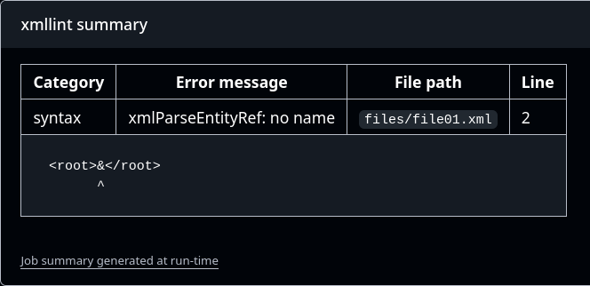
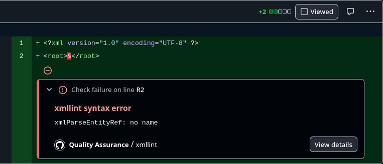

# xmllint Action

This action parses and validates XML documents with [libxml2](https://gitlab.gnome.org/GNOME/libxml2)'s
`xmllint`. Errors are available as JSON and HTML. The job summary will 
contain the latter.

## Sales display

### Job summary



### Code annotation




## Manual

### Example usage in a workflow

```yaml
---

name: Quality Assurance

on:
  pull_request:
  push:
    branches:
      - main

jobs:

  xmllint:
    runs-on: ubuntu-latest
    steps:
      - uses: actions/checkout@v5
      - uses: docker://ghcr.io/delb-xml/xmllint-action:0.2
        with:
          root_folder: files

...
```

### Inputs

- `root_folder`
  - Files to validate are searched in this directory and its subfolders.
    The path must be relative to the current working directory.
  - Defaults to `.`
- `file_pattern`
  - This globbing filter will be applied to select files to be validated.
  - Defaults to `*.xml`
- `huge_files`
  - If `"on"`, the `--huge` option will be passed to `xmllint`.
  - Defaults to `false`
- `validate`
  - If `"on"`, the `--validate` option will be passed to `xmllint`.
  - Requires DTDs to be assigned to each document.
  - Defaults to `false`

### Outputs

- `errors_html`
  - An HTML table that lists all errors.
- `errors_json`
  - A JSON encoded array of error objects with these fields:
    - `file` — path of the file
    - `line` — line where the error was spotted
    - `category` — either `syntax` or `validity`
    - `message` — the emitted error message
    - `snippet` — a snippet with a portion of the faulty markup, separated by 
      a newline character the second line contains a caret character that acts
      as optical pointer
